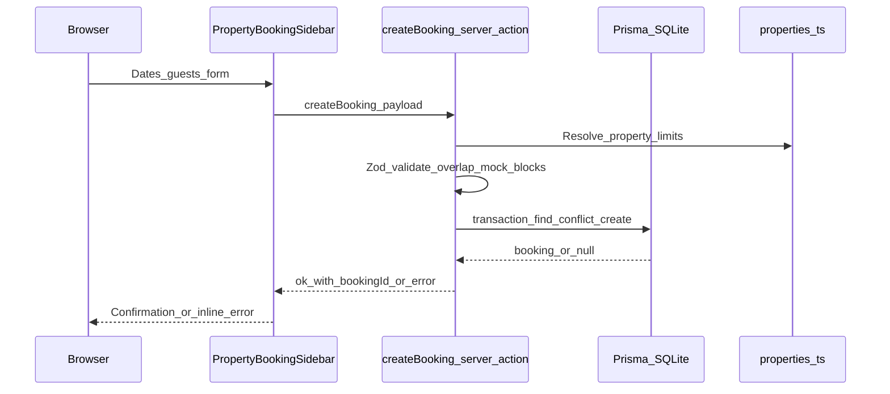
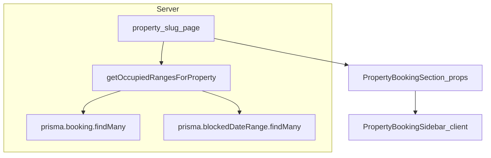

# Architecture — Stay Victoria (airbnb-cloned)

## Overview

Listing image assets and stable slugs live in **static** TypeScript modules under `src/lib/data/`; admin edits are persisted as `PropertyOverride` rows and merged on read. **Availability** merges active SQLite bookings with admin-managed `BlockedDateRange` rows via Prisma. Guests submit **booking requests** through a **Server Action** that validates with Zod and writes inside a Prisma transaction.

## Request path: booking request

## Read path: property page

If the database query throws (for example, missing `DATABASE_URL` or corrupt file), listing pages keep rendering with an empty availability set and booking submissions return a friendly service error.

## Admin workspace

The `/admin` route contains a responsive overview, listing editor, and per-property calendar. Mutations use Server Actions with Zod validation and call `revalidatePath` for both admin and guest routes. Blocking and booking creation repeat overlap checks inside Prisma transactions so an admin block cannot silently conflict with a guest reservation.

## Folder conventions

| Area | Location |
|------|-----------|
| Domain pure logic | `src/lib/domain/` |
| Shared types | `src/lib/types/` |
| Static seed data | `src/lib/data/` |
| Server-only data access | `src/lib/server/` |
| Prisma client | `src/lib/db/prisma.ts` |
| Server Actions | `src/app/actions/` |
| UI components | `src/app/components/` |

## Decisions

See [docs/adr](./adr/) for timezone and persistence choices.
