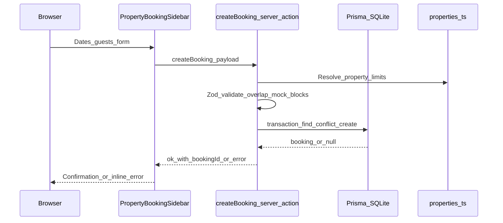
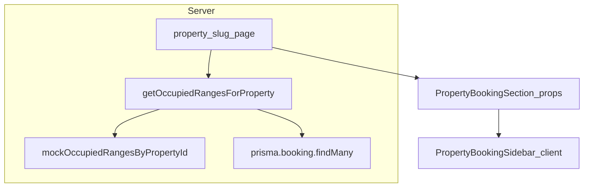

# Architecture — Stay Victoria (airbnb-cloned)

## Overview

Listings and marketing content are **static** TypeScript modules under `src/lib/data/`. **Availability** merges mock blocked ranges with **SQLite** bookings via Prisma. Guests submit **booking requests** through a **Server Action** that validates with Zod and writes inside a Prisma transaction.

## Request path: booking request

## Read path: property page

If the database query throws (for example, missing `DATABASE_URL` or corrupt file), `getOccupiedRangesForProperty` falls back to **mock ranges only** so listing pages keep rendering.

## Folder conventions

| Area | Location |
|------|-----------|
| Domain pure logic | `src/lib/domain/` |
| Shared types | `src/lib/types/` |
| Static seed data | `src/lib/data/` |
| Server-only data access | `src/lib/server/` |
| Prisma client | `src/lib/db/prisma.ts` |
| Server Actions | `src/app/actions/` |
| UI components | `src/app/components/` |

## Decisions

See [docs/adr](./adr/) for timezone and persistence choices.
